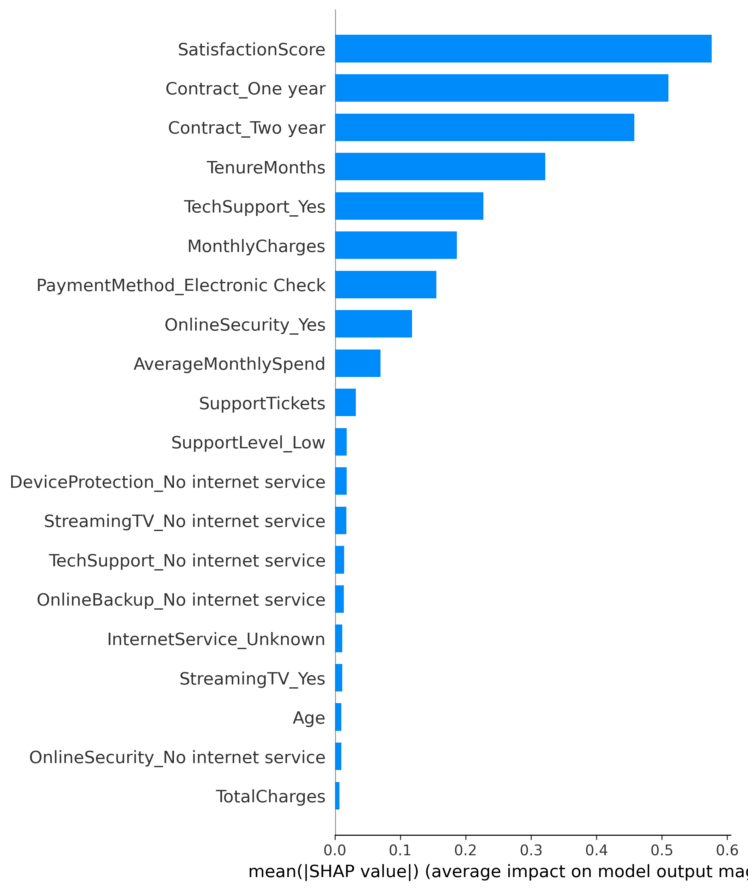
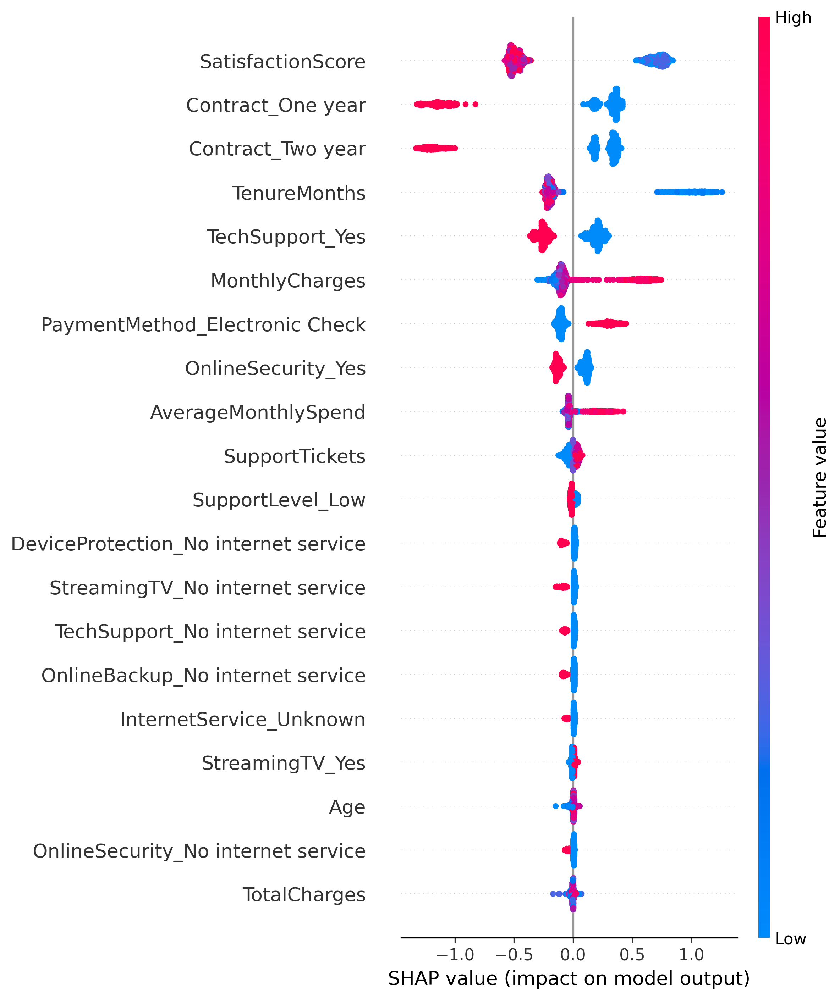

# Customer Churn Prediction Using Machine Learning

## Project Overview

Customer churn is a major challenge for businesses, especially in the telecommunications industry. Identifying customers who are likely to leave a service allows businesses to take proactive retention measures and improve customer loyalty.

This project develops an end-to-end machine learning system to predict customer churn using customer demographics, service usage, account information, and customer behavior.

Multiple classification algorithms were trained and evaluated. The **Gradient Boosting Classifier** achieved the best overall performance and was selected as the final machine learning model.

The final model is integrated into a **Flask web application** that allows users to enter customer information and receive a churn prediction, churn probability, and customer risk level.

Model explainability is also implemented using **SHAP (SHapley Additive exPlanations)** to understand the factors influencing customer churn predictions.

---

## Problem Statement

The objective of this project is to develop a machine learning system capable of predicting whether a customer is likely to churn.

By identifying high-risk customers, businesses can develop targeted retention strategies, provide personalized offers, improve customer satisfaction, and reduce customer loss.

---

## Project Workflow

The project follows a structured end-to-end machine learning workflow:

1. Data Understanding
2. Data Cleaning
3. Exploratory Data Analysis
4. Feature Engineering
5. Data Preprocessing
6. Model Building
7. Model Evaluation
8. Hyperparameter Tuning
9. Model Saving
10. Model Explainability using SHAP
11. Prediction Pipeline Development
12. Flask Web Application Development
13. User Interface Development
14. Project Documentation

---

## Project Structure

```text
Customer-Churn-Prediction/
│
├── app/
│   ├── app.py
│   │
│   ├── static/
│   │   └── style.css
│   │
│   └── templates/
│       └── index.html
│
├── data/
│   ├── raw/
│   │   └── customer_churn.csv
│   │
│   └── processed/
│       ├── X_test.csv
│       ├── X_train.csv
│       ├── customer_churn_cleaned.csv
│       ├── customer_churn_feature_engineered.csv
│       ├── y_test.csv
│       └── y_train.csv
│
├── models/
│   ├── customer_churn_model.pkl
│   └── feature_names.pkl
│
├── notebooks/
│   ├── 01_data_understanding.ipynb
│   ├── 02_data_cleaning.ipynb
│   ├── 03_exploratory_data_analysis.ipynb
│   ├── 04_feature_engineering.ipynb
│   ├── 05_data_preprocessing.ipynb
│   ├── 06_model_building.ipynb
│   └── 07_model_explainability.ipynb
│
├── reports/
│   └── figures/
│       ├── shap_feature_importance.png
│       └── shap_summary_plot.png
│
├── src/
│   ├── predict.py
│   └── preprocess_input.py
│
├── .gitignore
├── README.md
└── requirements.txt
```

---

## Technologies Used

### Programming Language

- Python

### Data Analysis and Visualization

- Pandas
- NumPy
- Matplotlib
- Seaborn

### Machine Learning

- Scikit-learn
- Gradient Boosting Classifier
- GridSearchCV
- Joblib

### Model Explainability

- SHAP

### Web Development

- Flask
- HTML
- CSS
- Jinja2

### Development Tools

- Jupyter Notebook
- Visual Studio Code
- Git
- GitHub

---

## Data Understanding

The dataset was initially explored to understand its structure, features, data types, missing values, and target variable.

The analysis focused on:

- Customer demographic information
- Customer service usage
- Account-related information
- Customer spending behavior
- Customer satisfaction
- Customer churn behavior

Key data understanding tasks included:

- Examining dataset dimensions
- Understanding feature data types
- Identifying missing values
- Checking duplicate records
- Analyzing the target variable
- Reviewing categorical and numerical features

---

## Data Cleaning

Data cleaning was performed to improve data quality and prepare the dataset for analysis.

The following tasks were carried out:

- Checked missing values
- Identified duplicate records
- Corrected data types
- Handled inconsistent values
- Prepared a cleaned dataset for exploratory data analysis and machine learning

The cleaned dataset was saved for use in subsequent project stages.

---

## Exploratory Data Analysis

Exploratory Data Analysis was performed to understand customer behavior and identify patterns associated with customer churn.

The analysis included:

- Customer churn distribution
- Customer demographic analysis
- Service usage patterns
- Customer tenure analysis
- Contract type analysis
- Monthly charges analysis
- Customer satisfaction analysis
- Feature relationships and correlations

Visualizations were created using **Matplotlib** and **Seaborn** to identify important trends and patterns in the dataset.

---

## Feature Engineering

Feature engineering was performed to prepare meaningful input variables for machine learning.

The process included:

- Transforming categorical features
- Preparing numerical representations of categorical variables
- Selecting relevant customer features
- Preparing the target variable
- Ensuring features were suitable for machine learning algorithms

The feature-engineered dataset was saved for model preprocessing and training.

---

## Data Preprocessing

The dataset was prepared for machine learning using the following preprocessing steps:

- Feature and target separation
- Categorical feature encoding
- Train-test splitting
- Feature scaling where required
- Preparation of training and testing datasets

The processed datasets were saved to maintain a reproducible machine learning workflow.

---

## Machine Learning Models

Multiple classification algorithms were trained and evaluated to identify the most suitable model for customer churn prediction.

The following machine learning models were used:

- Logistic Regression
- Decision Tree Classifier
- Random Forest Classifier
- K-Nearest Neighbors
- Naive Bayes
- Support Vector Machine
- Gradient Boosting Classifier

The performance of the models was compared using multiple classification evaluation metrics.

---

## Model Evaluation

The machine learning models were evaluated using the following metrics:

- Accuracy
- Precision
- Recall
- F1 Score
- ROC-AUC Score
- Confusion Matrix
- Classification Report

After comparing the trained models, the **Gradient Boosting Classifier** was selected as the best-performing model based on its overall performance.

### Model Performance

| Metric | Score |
| --- | --- |
| Accuracy | 76.45% |
| Precision | 78.56% |
| Recall | 76.71% |
| F1 Score | 77.62% |
| ROC-AUC Score | 83.78% |

The Gradient Boosting model demonstrated a good balance between precision and recall.

The ROC-AUC score of **83.78%** indicates that the model has a strong ability to distinguish between customers who are likely to churn and customers who are likely to remain.

---

## Hyperparameter Tuning

Hyperparameter tuning was performed on the **Gradient Boosting Classifier** to optimize model performance.

**GridSearchCV** was used to systematically evaluate different combinations of model hyperparameters using cross-validation.

The best estimator identified during the GridSearchCV process was selected as the final optimized machine learning model.

---

## Model Explainability Using SHAP

Machine learning model explainability was implemented using **SHAP (SHapley Additive exPlanations)**.

SHAP helps explain how different customer features influence the model's churn predictions.

The explainability analysis includes:

- Global feature importance analysis
- SHAP feature importance visualization
- SHAP summary plot
- Analysis of features influencing customer churn

Generated SHAP visualizations are stored in:

```text
reports/figures/
```

### SHAP Feature Importance



### SHAP Summary Plot



Model explainability helps businesses understand the major factors associated with customer churn instead of relying only on prediction results.

---

## Model Saving

The final trained machine learning model was saved using **Joblib** for future inference and deployment.

The following model artifacts were created:

- `customer_churn_model.pkl` - Final trained Gradient Boosting model
- `feature_names.pkl` - Input feature names and feature order

Saving the trained model eliminates the need to retrain the model whenever a new prediction is required.

---

## Prediction Pipeline

A reusable prediction pipeline was developed inside the `src` directory.

### Input Preprocessing

The `preprocess_input.py` module prepares customer input data for the trained machine learning model.

It ensures that:

- Customer input features are correctly formatted
- Categorical values are transformed
- Feature columns match the training data
- Feature order is maintained

### Churn Prediction

The `predict.py` module loads the trained machine learning model and performs customer churn prediction.

The prediction system returns:

- Customer churn prediction
- Churn probability
- Customer risk level

Risk levels are categorized as:

- LOW RISK
- MEDIUM RISK
- HIGH RISK

---

## Flask Web Application

The trained machine learning model is integrated into a **Flask web application**.

The application provides an interactive interface where users can enter customer information and generate churn predictions.

### Application Features

- Interactive customer information form
- Real-time machine learning prediction
- Churn probability calculation
- Customer risk level classification
- Professional prediction result card
- Responsive user interface
- Mobile-friendly design

The application displays whether a customer is likely to:

- CHURN
- STAY

It also displays the predicted churn probability and customer risk level.

---

## Running the Project

Clone the repository:

```bash
git clone https://github.com/Ramtej9989/Customer_Churn_Prediction.git
```

Navigate to the project directory:

```bash
cd Customer_Churn_Prediction
```

Create a virtual environment:

```bash
python -m venv .venv
```

### Activate the Virtual Environment

For macOS or Linux:

```bash
source .venv/bin/activate
```

For Windows:

```bash
.venv\Scripts\activate
```

Install the required dependencies:

```bash
pip install -r requirements.txt
```

---

## Running the Flask Application

Navigate to the application directory:

```bash
cd app
```

Run the Flask application:

```bash
python app.py
```

Open the application in your browser:

```text
http://127.0.0.1:5000
```

Enter customer information and click **Predict Customer Churn** to generate a prediction.

---

## Notebook Execution Order

Run the notebooks in the following order:

```text
01_data_understanding.ipynb
        ↓
02_data_cleaning.ipynb
        ↓
03_exploratory_data_analysis.ipynb
        ↓
04_feature_engineering.ipynb
        ↓
05_data_preprocessing.ipynb
        ↓
06_model_building.ipynb
        ↓
07_model_explainability.ipynb
```

Each notebook represents a specific stage of the machine learning workflow.

---

## Key Project Outcomes

- Developed an end-to-end customer churn prediction system
- Performed data cleaning and exploratory data analysis
- Analyzed customer behavior and churn patterns
- Performed feature engineering and data preprocessing
- Trained seven machine learning classification algorithms
- Compared models using multiple evaluation metrics
- Selected Gradient Boosting as the best-performing classifier
- Applied hyperparameter tuning using GridSearchCV
- Achieved a ROC-AUC score of 83.78%
- Implemented model explainability using SHAP
- Developed reusable preprocessing and prediction modules
- Integrated the trained model with Flask
- Built an interactive customer churn prediction web application
- Developed a responsive and professional user interface
- Organized the project using a professional data science project structure

---

## Future Improvements

The project can be further improved by:

- Optimizing the classification probability threshold
- Applying advanced class imbalance techniques
- Adding customer-specific SHAP explanations to the web application
- Developing a REST API for churn prediction
- Adding batch customer prediction using CSV uploads
- Deploying the application to a cloud platform
- Implementing model monitoring
- Adding automated model retraining

---

## Conclusion

This project demonstrates a complete end-to-end machine learning workflow for customer churn prediction.

The project covers data understanding, data cleaning, exploratory data analysis, feature engineering, preprocessing, machine learning model development, model evaluation, hyperparameter tuning, model explainability, prediction pipeline development, and web application integration.

Multiple classification algorithms were trained and evaluated. The **Gradient Boosting Classifier** was selected as the final model based on its overall performance.

The final model achieved an **Accuracy of 76.45%** and a **ROC-AUC score of 83.78%**, demonstrating good predictive and class discrimination performance.

The trained machine learning model was integrated into a **Flask web application**, allowing users to enter customer information and receive churn predictions, probability scores, and customer risk levels.

This project demonstrates practical skills in **Python, Data Analysis, Exploratory Data Analysis, Machine Learning, Model Evaluation, Hyperparameter Tuning, SHAP Model Explainability, Flask Web Development, and End-to-End Data Science Project Development**.

---

## Author

**Rama Satya Teja Bonthu**

AI & Data Science Graduate

GitHub: Ramtej9989